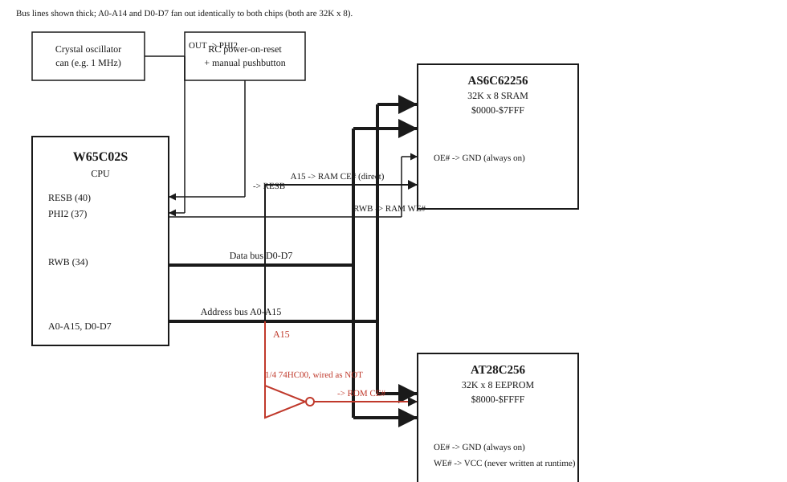

# Building this for real: a breadboard 6502 computer

This is the practical build companion to [hardware-path.md](hardware-path.md)
(which covers *why* real hardware would need to change vs. the emulator) —
this file is the actual parts list, wiring, and staged plan for building a
real, physical version of this computer, breadboard by breadboard.

**Built incrementally, proven at each stage before adding the next** (see
[roadmap.md](roadmap.md) for the same philosophy applied to the software
side): each stage below is a complete, working thing on its own, not a
partial step that only works once everything is finished.

- **Stage 1 (this doc, fully detailed)** — bring-up: CPU + RAM + ROM +
  clock + reset, nothing else. Success looks like a simple hand-written
  program visibly running.
- **Stage 2 (outline for now)** — add the W65C51N ACIA + a USB-serial
  cable. This reuses our existing software almost unchanged (`msbasic/`,
  `src/c6502/run.py`'s register conventions) and gets a real BASIC prompt
  over a PC terminal, with the least new hardware.
- **Stage 3 (outline for now)** — add a Raspberry Pi Pico coprocessor for
  VGA output + PS/2 keyboard input, for a standalone monitor+keyboard
  experience with no PC required. See the chat history / `hardware-path.md`
  for the design reasoning (a coprocessor generates VGA/PS2 timing in
  firmware and presents simple registers to the 6502 — the CPU itself
  never touches video timing or keyboard scancodes).

We'll flesh out Stages 2 and 3 with the same level of detail as Stage 1
once we actually get there.

## Reference datasheets

Run `scripts/fetch_datasheets.sh` to download these into the gitignored
`docs/hardware/datasheets/` — not vendored (manufacturer-copyrighted,
multi-MB each), same reasoning as `scripts/fetch_dormann_tests.sh` /
`scripts/fetch_msbasic.sh` elsewhere in this repo:

- W65C02S CPU: [westerndesigncenter.com/wdc/documentation/w65c02s.pdf](https://www.westerndesigncenter.com/wdc/documentation/w65c02s.pdf)
- W65C51N ACIA (Stage 2): [westerndesigncenter.com/wdc/documentation/w65c51n.pdf](https://www.westerndesigncenter.com/wdc/documentation/w65c51n.pdf)
- AS6C62256 SRAM: [alliancememory.com](https://www.alliancememory.com/wp-content/uploads/AS6C62256-23-March-2016-rev1.2.pdf)
- AT28C256 EEPROM: [Microchip doc0006.pdf](https://ww1.microchip.com/downloads/en/DeviceDoc/doc0006.pdf)

## Stage 1: bring-up (CPU + RAM + ROM + clock + reset)

### Goal

Prove the core loop works — the CPU fetches instructions, reads/writes
RAM, and executes ROM — before adding anything else. No serial, no video,
no keyboard yet. Success is a small hand-assembled program visibly doing
something observable (see "Bring-up program" below).

### Parts

| Part | Role | Where to get it |
|---|---|---|
| WDC W65C02S (40-pin DIP) | CPU | [Mouser](https://www.mouser.com/ProductDetail/Western-Design-Center-WDC/W65C02S6TPG-14) · [DigiKey](https://www.digikey.com/en/supplier-centers/western-design-center-inc) · [Jameco](https://www.jameco.com) (stocks the full WDC line) · [WDC's own "Where to Buy"](https://wdc65xx.com/where-to-buy) |
| AS6C62256 (28-pin DIP, 32K×8 SRAM) | RAM, $0000-$7FFF | [DigiKey (AS6C62256-55PCN)](https://www.digikey.com/en/products/detail/alliance-memory-inc/AS6C62256-55PCN/4234592) |
| AT28C256 (28-pin DIP, 32K×8 EEPROM) | ROM, $8000-$FFFF | [Mouser (AT28C256-15PU)](https://www.mouser.com/en/ProductDetail/Microchip-Technology/AT28C256-15PU) |
| 74HC00 (quad 2-input NAND) | Address decode (only 1 of 4 gates used in Stage 1 — the rest are spare for Stage 2) | Any distributor (Mouser/DigiKey/Jameco/Amazon) — extremely common part |
| Crystal oscillator can (e.g. 1 MHz, half-size DIP) | Clock | Any distributor — check your specific can's datasheet for exact pin order, packages vary |
| 2 full-size breadboards | Chassis (this stage's chip footprint needs ~2; expect a 3rd for Stage 2) | Amazon/SparkFun/Adafruit |
| Jumper wire kit | Wiring | Amazon/SparkFun/Adafruit |
| 5V breadboard power supply module (or a bench supply) | Power | Amazon/SparkFun/Adafruit |
| Pushbutton, 1× ~1µF capacitor, 1× ~10kΩ resistor | Manual reset circuit | Any distributor |
| A few LEDs + ~330Ω resistors | Bring-up indicator (see below) | Any distributor |
| 0.1µF ceramic capacitors (one per chip) | Decoupling — standard practice, not optional in practice even if it "works" without them on a breadboard sometimes | Any distributor |

**Tool you'll also need: an EEPROM programmer** (easy to forget, but you
can't get the assembled program onto the AT28C256 without one). A cheap
universal programmer like the **TL866II Plus** (widely available on
Amazon/AliExpress) is the simplest path — supports the AT28C256 and many
other classic parts. A DIY Arduino-based EEPROM programmer is a fun
alternative build if you'd rather not buy one, but it's its own side
project; buying one keeps the focus on the CPU board itself for now.

### Memory map (Stage 1 only — no I/O yet)

```
$0000-$7FFF  RAM (AS6C62256)
$8000-$FFFF  ROM (AT28C256)
```
One address line (A15) is the entire decode: RAM is selected when A15 is
low, ROM when A15 is high. This is deliberately the same 32K/32K split as
our emulator's own memory map (`docs/architecture.md`) — Stage 2 carves an
I/O window out of the RAM half, the same way our software `Bus` already
does, so the real board and the emulator stay in sync as we go.

### Wiring



The diagram shows the mechanism that matters here — how one gate turns
A15 into "which chip is this address for" — rather than every individual
wire; address (A0-A15) and data (D0-D7) buses are drawn as single thick
lines since they fan out identically to both memory chips (both are
32K×8, so they share the exact same address/data pin layout — see the
pin tables below).

**Pin references** (verified against the actual datasheets, not
guessed — see the links above):

*W65C02S (40-pin DIP)*: 1=VPB, 2=RDY, 3=PHI1O, 4=IRQB, 5=MLB, 6=NMIB,
7=SYNC, 8=VDD, 9-20=A0-A11, 21=VSS, 22-25=A12-A15, 26-33=D7-D0 (note:
descending), 34=RWB, 35=NC, 36=BE, 37=PHI2, 38=SOB, 39=PHI2O, 40=RESB.

*AS6C62256 / AT28C256 (28-pin DIP, identical pinout)*: 1=A14, 2=A12,
3=A7, 4=A6, 5=A5, 6=A4, 7=A3, 8=A2, 9=A1, 10=A0, 11-13=DQ0-DQ2, 14=Vss
(GND), 15-19=DQ3-DQ7, 20=CE#, 21=A10, 22=OE#, 23=A11, 24=A9, 25=A8,
26=A13, 27=WE#, 28=Vcc.

**Connections**:
- CPU A0-A14 -> both RAM and ROM's A0-A14 (identical, direct — both chips
  are 32K so they use all 15 low address lines the same way).
- CPU D0-D7 -> both RAM and ROM's DQ0-DQ7 (shared data bus — this is safe
  because RAM and ROM are never both enabled at once, see below).
- CPU A15 -> RAM's CE# directly, **and** -> one 74HC00 gate wired as an
  inverter (tie its two inputs together) -> ROM's CE#. A15 high selects
  ROM ($8000-$FFFF); A15 low selects RAM ($0000-$7FFF).
- CPU RWB -> RAM's WE# directly.
- RAM's OE# -> GND (tied permanently enabled — safe because WE# takes
  priority over OE# internally when both are asserted, per the SRAM's
  own truth table).
- ROM's OE# -> GND (same reasoning). ROM's WE# -> VCC (tied permanently
  *inactive* — we only write to the EEPROM via the external programmer,
  never at runtime).
- Oscillator output -> CPU PHI2 (pin 37).
- Reset circuit -> CPU RESB (pin 40): capacitor from RESB to GND,
  resistor from RESB to VCC, pushbutton from RESB to GND for a manual
  reset. At power-on the cap holds RESB low briefly before it charges up
  through the resistor, giving a clean reset pulse; pressing the button
  does the same thing on demand.
- VCC/GND to every chip, plus a 0.1µF decoupling capacitor across VCC/GND
  right at each chip's power pins.
- BE (pin 36, "Bus Enable") -> VCC (tied permanently high — this is a
  65C02-specific pin with no NMOS 6502 equivalent; tying it high just
  means "the bus is always enabled," which is what we want).

### Bring-up program

A tiny hand-assembled program (using our own assembler,
`c6502.asm.assemble`) that repeatedly writes an incrementing counter to a
RAM address — with an LED (through a ~330Ω resistor) connected to one of
the low address lines (e.g. A0 or A1), you'll see it visibly toggle as
the CPU fetches instructions in the loop, confirming the address bus,
data bus, RAM, ROM, clock, and reset are all actually working together —
this is the same classic technique used in most breadboard 6502 bring-up
guides.

```python
from c6502.asm import assemble

source = """
    .org $8000
reset:
    LDA #$00
    STA $00
loop:
    INC $00
    LDA $00
    JMP loop
    .org $FFFC
    .word reset
"""
image = assemble(source)
# image.data is what gets burned to the AT28C256 with your EEPROM
# programmer, at image.origin ($8000).
```

### Verification

- Power on: the reset LED circuit should hold the CPU in reset briefly,
  then release it.
- If you wired an LED to a low address line as above, it should visibly
  toggle at a rate related to the oscillator frequency (fast enough to
  look dim/flickery rather than a slow blink at typical oscillator
  speeds — a logic probe or oscilloscope makes this much easier to
  confirm precisely, but isn't required to see *something* happening).
- If nothing happens: check the oscillator is actually running first
  (probe PHI2), then reset (probe RESB releases high after power-on),
  then confirm the ROM was actually programmed at the right address
  range and the reset vector at `$FFFC` points at your program's start.

## Stage 2 (outline): serial console

Add the W65C51N ACIA (same chip our `AciaDevice` already models — see
`docs/architecture.md`) at a new address (carving an I/O window out of
the RAM half, mirroring our software `Bus`), plus a USB-to-TTL-serial
cable to a PC. **Watch the logic level**: the ACIA is a 5V part producing
5V TTL serial levels, not 3.3V — make sure whatever USB-serial
adapter/cable you get is a genuine 5V TTL adapter (many cheap
CH340/CP2102 boards have a jumper for this; some FTDI cables are
3.3V-only) rather than assuming any USB-serial cable works. Once wired
up, `msbasic/bios.s`'s I/O routines should need little to no change —
same register addresses and semantics we already built and tested in the
emulator.

## Stage 3 (outline): VGA + PS/2 via a Pico coprocessor

Add a Raspberry Pi Pico presenting a simple register interface (same
shape as the ACIA) to the 6502, with its own firmware generating VGA
timing and reading PS/2 scancodes — see the project chat history and
`hardware-path.md` for the design reasoning, and the
[JJ65C02 project](https://hackaday.io/project/193153-jj65c02/log/225161-raspberry-pi-pico-video-and-ps2-keyboard)
for a real, published reference doing almost exactly this combination.
